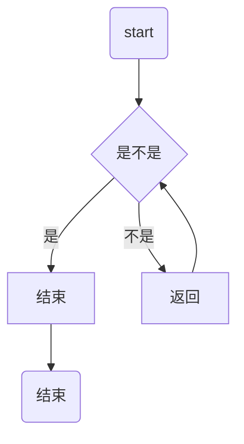

# 一级标题
## 二级标题
### 三级标题
#### 四级标题
##### 五级标题
###### 六级标题

*我是斜体*
_我也是斜体_
**我是粗体**
__我也是粗体__

* 我是星号列表1
* 我是星号列表2
* 我是星号列表3

+ 我是加号列表1
    哈哈，我还是内容
+ 我是加号列表2

- 我是减号列表1
- 我是减号列表2

1. 我是有序列表1
2. 我是有序列表2

我是链接[百度](http://www.baidu.com/)
我是链接[百度](http://www.baidu.com/ "www.baidu.com")

BAT是[百度][b]，[阿里][a]，[腾讯][3]
[b]: http://www.baidu.com/ "http://www.baidu.com/"
[A]: http://www.aliyun.com/ "http://www.aliyun.com/"
[3]: http://www.qq.com/ "http://www.qq.com/"

我是一只程序猿，我的代码`hello`

下面是整段代码
```cpp
int main
{
	whilt(1)
    {
    	printf("hello world");
        sleep(1);
    }
}
```
* * *

>背影
　　朱自清
- - - 
>>　　我与父亲不相见已二年余了，我最不能忘记的是他的背影。那年冬天，祖母死了，父亲的差使也交卸了，正是祸不单行的日子，我从北京到徐州，打算跟着父亲奔丧回家。到徐州见着父亲，看见满院狼藉的东西，又想起祖母，不禁簌簌地流下眼泪。父亲说，“事已如此，不必难过，好在天无绝人之路！”
　　回家变卖典质，父亲还了亏空；又借钱办了丧事。这些日子，家中光景很是惨淡，一半为了丧事，一半为了父亲赋闲。丧事完毕，父亲要到南京谋事，我也要回北京念书，我们便同行。
　　到南京时，有朋友约去游逛，勾留了一日；第二日上午便须渡江到浦口，下午上车北去。父亲因为事忙，本已说定不送我，叫旅馆里一个熟识的茶房陪我同去。他再三嘱咐茶房，甚是仔细。但他终于不放心，怕茶房不妥帖；颇踌躇了一会。其实我那年已二十岁，北京已来往过两三次，是没有甚么要紧的了。他踌躇了一会，终于决定还是自己送我去。我两三回劝他不必去；他只说，“不要紧，他们去不好！”
　　我们过了江，进了车站。我买票，他忙着照看行李。行李太多了，得向脚夫行些小费，才可过去。他便又忙着和他们讲价钱。我那时真是聪明过分，总觉他说话不大漂亮，非自己插嘴不可。但他终于讲定了价钱；就送我上车。他给我拣定了靠车门的一张椅子；我将他给我做的紫毛大衣铺好坐位。他嘱我路上小心，夜里警醒些，不要受凉。又嘱托茶房好好照应我。我心里暗笑他的迂；他们只认得钱，托他们直是白托！而且我这样大年纪的人，难道还不能料理自己么？唉，我现在想想，那时真是太聪明了！
　　我说道，“爸爸，你走吧。”他望车外看了看，说，“我买几个橘子去。你就在此地，不要走动。”我看那边月台的栅栏外有几个卖东西的等着顾客。走到那边月台，须穿过铁道，须跳下去又爬上去。父亲是一个胖子，走过去自然要费事些。我本来要去的，他不肯，只好让他去。我看见他戴着黑布小帽，穿着黑布大马褂，深青布棉袍，蹒跚地走到铁道边，慢慢探身下去，尚不大难。可是他穿过铁道，要爬上那边月台，就不容易了。他用两手攀着上面，两脚再向上缩；他肥胖的身子向左微倾，显出努力的样子。这时我看见他的背影，我的泪很快地流下来了。我赶紧拭干了泪，怕他看见，也怕别人看见。我再向外看时，他已抱了朱红的橘子望回走了。过铁道时，他先将橘子散放在地上，自己慢慢爬下，再抱起橘子走。到这边时，我赶紧去搀他。他和我走到车上，将橘子一股脑儿放在我的皮大衣上。于是扑扑衣上的泥土，心里很轻松似的，过一会说，“我走了；到那边来信！”我望着他走出去。他走了几步，回过头看见我，说，“进去吧，里边没人。”等他的背影混入来来往往的人里，再找不着了，我便进来坐下，我的眼泪又来了。
　　近几年来，父亲和我都是东奔西走，家中光景是一日不如一日。他少年出外谋生，独力支持，做了许多大事。那知老境却如此颓唐！他触目伤怀，自然情不能自已。情郁于中，自然要发之于外；家庭琐屑便往往触他之怒。他待我渐渐不同往日。但最近两年的不见，他终于忘却我的不好，只是惦记着我，惦记着我的儿子。我北来后，他写了一信给我，信中说道，“我身体平安，惟膀子疼痛利害，举箸提笔，诸多不便，大约大去之期不远矣。”我读到此处，在晶莹的泪光中，又看见那肥胖的，青布棉袍，黑布马褂的背影。唉！我不知何时再能与他相见！

>作品简析
>>　　《背影》是现代作家朱自清于1925年所写的一篇回忆性散文。这篇散文叙述的是作者离开南京到北京大学，父亲送他到浦口车站，照料他上车，并替他买橘子的情形。在作者脑海里印象最深刻的，是他父亲替他买橘子时在月台爬上攀下时的背影。作者用朴素的文字，把父亲对儿女的爱，表达得深刻细腻，真挚感动，从平凡的事件中，呈现出父亲的关怀和爱护。

>作者简介
>>　　朱自清（1898~1948），原名自华，字佩弦，号秋实。江苏扬州人。“文学研究会”的早期成员，现代著名的散文家、学者。原任清华大学教授，抗日战争爆发后转西南联合大学任教。在抗日民主运动的影响下，政治态度明显倾向进步。晚年积极参加反帝民主运动。他的散文，结构严谨，笔触细致，不论写景抒情，均能通过细密观察或深入体味，委婉地表现出对自然景色的内心感受。抒发自己的真挚感情，具有浓厚的诗情画意。主要作品有《毁灭》、《踪迹》、《背影》、《欧游杂记》、《伦敦杂记》等。





